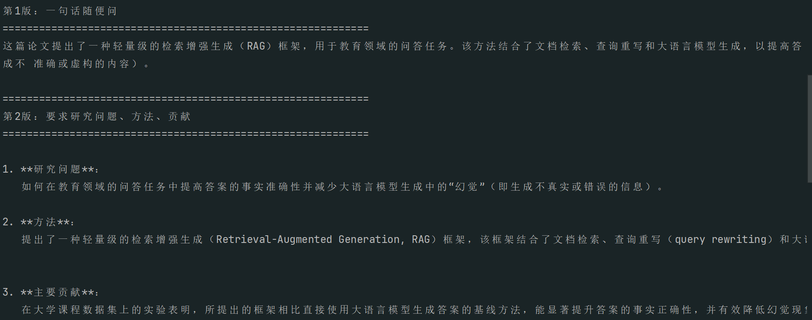
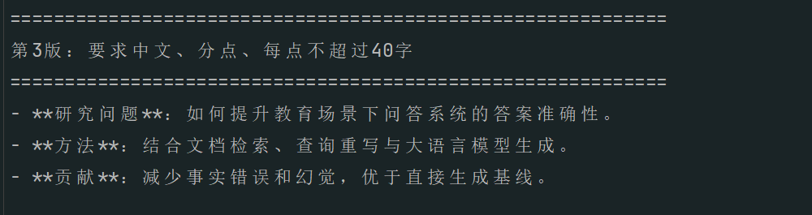

# Day 16 Prompt 设计笔记

## 今天的目标

学习如何通过更清晰的 prompt 设计，让模型输出更稳定、更符合要求的结果。

---

## 测试任务

任务：总结一段论文摘要

输入材料是一段关于教育问答系统与 RAG 的论文摘要。

---

## Prompt 第1版

### 写法
请总结下面这段论文摘要。

### 特点
- 写法最简单
- 约束最少
- 模型输出较自由

### 观察
- 可以完成任务
- 但输出风格不够稳定
- 不一定按我想要的结构组织内容

---

## Prompt 第2版

### 写法
要求模型输出：
1. 研究问题
2. 方法
3. 主要贡献

### 特点
- 任务更具体
- 输出结构更清晰
- 更适合做信息提取类任务

### 观察
- 回答更有条理
- 更容易抓住论文核心信息
- 比第1版更适合后续处理

---

## Prompt 第3版

### 写法
要求模型：
- 用中文
- 按研究问题、方法、贡献输出
- 使用分点形式
- 每点不超过 40 字
- 适合大学生阅读

### 特点
- 对输出格式和风格约束更强
- 结果更规整
- 可控性更高

### 观察
- 输出最符合预期
- 结果更简洁
- 更适合产品化展示

---

## 我的理解

通过今天的练习，我发现：

1. 同一个任务，prompt 写法不同，输出效果差别很大  
2. 只说“总结一下”通常不够，应该把任务说具体  
3. 如果希望模型稳定输出，就要明确要求格式和风格  
4. system prompt 更适合规定角色和总体风格  
5. user prompt 更适合放具体任务和输入内容  

---

## 今天学到的 prompt 设计原则

- 角色清楚
- 任务具体
- 格式明确
- 提供足够上下文

---

## 下一步可以继续尝试的方向

1. 比较不同 system prompt 的影响  
2. 尝试限制输出长度  
3. 尝试让模型输出表格或 JSON  
4. 尝试多轮对话中的 prompt 设计

## 运行截图

