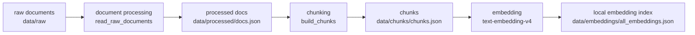
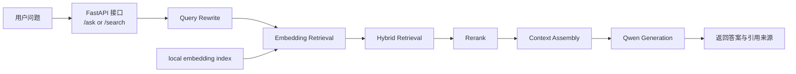

# Qwen RAG Project Architecture

本文档用于说明 `qwen_rag_project` 的整体架构、离线建库流程和在线问答流程。项目定位是轻量级 RAG 后端学习项目，重点展示 RAG 主链路和基础工程化能力。

## 项目整体架构

项目以 FastAPI 作为 HTTP 接口层，以阿里云百炼 / DashScope 提供的 Qwen 相关模型作为 LLM、embedding 和 rerank 能力来源。数据侧使用本地文件保存原始文档、切分后的 chunks 和 embedding 索引。

核心模块：

- `main.py`：FastAPI 入口，提供 `/ping`、`/rebuild_index`、`/ask`、`/search`
- `services/document_service.py`：读取原始文档，保存 processed docs 和 chunks
- `services/index_service.py`：串联离线建库流程
- `services/embedding_service.py`：调用 embedding 模型并保存 / 加载本地 embedding 索引
- `services/retrieval_service.py`：向量检索
- `services/hybrid_retrieval_v1.py`：向量分 + 关键词分的简化 hybrid retrieval
- `services/rerank_service.py`：调用 rerank 模型做精排
- `services/query_rewrite_service.py`：将用户问题改写成更适合检索的 query
- `services/generation_service.py`：根据检索上下文生成回答
- `services/logger_service.py`、`services/exceptions.py`：日志与统一异常处理

## 离线建库流程

离线建库由 `/rebuild_index` 触发，主要目标是把 `data/raw/` 下的 `.txt` / `.md` 文档转换成本地 embedding 索引。

流程：

1. 读取 `data/raw/` 中的原始文档
2. 跳过空文档，保存标准化后的 `docs.json`
3. 按 `config.yaml` 中的 `chunk_size` 和 `overlap` 切分 chunk
4. 调用 embedding 模型生成向量
5. 保存到 `data/embeddings/all_embeddings.json`



## 在线问答流程

在线问答由 `/ask` 触发，目标是基于本地知识库内容回答用户问题，并返回引用来源。`/search` 使用类似链路，但更偏向调试检索过程，会返回 embedding、hybrid、rerank 各阶段结果。

流程：

1. 接收用户问题
2. 可选执行 query rewrite
3. 加载本地 embedding 索引
4. 进行 embedding retrieval
5. 可选融合 keyword matching，形成 hybrid retrieval
6. 可选调用 rerank 模型精排
7. 组装最终上下文
8. 调用 Qwen 生成回答
9. 返回答案、引用来源和 trace_id



## 数据与配置

主要路径由 `config.yaml` 管理：

- `data/raw/`：原始 `.txt` / `.md` 文档
- `data/processed/docs.json`：标准化后的文档
- `data/chunks/chunks.json`：切分后的 chunks
- `data/embeddings/all_embeddings.json`：本地 embedding 索引

敏感信息通过环境变量管理，不写入代码：

```env
DASHSCOPE_API_KEY=your_api_key_here
APP_ENV=dev
```
